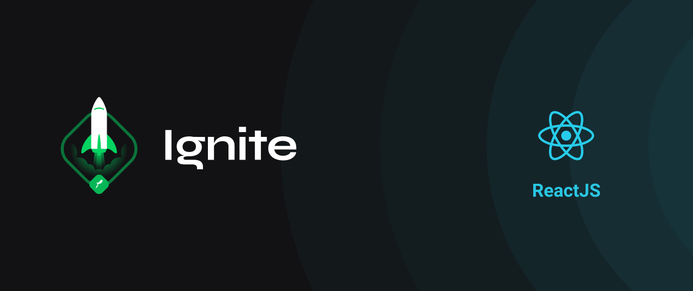

<h1 align="center">Ignite Journey</h1>

 
  

<h2>Lessons</h2>

<h3>Chapter 01</h3>

- [x] Fundamentos do ReactJS

<h3>Chapter 02</h3>

- [x] Primeira aplicação web com ReactJS

<h3>Chapter 03</h3>

- [x] Fundamentos do Next.JS
- [x] Back-end no front-end
- [x] Front-end JAMStack

<h3>Chapter 04</h3>

- [x] Contruindo interfaces do futuro
- [x] Data fetching e cache local
- [ ] Autenticação e autorização

<h3>Chapter 05</h3>

- [x] Performando app com ReactJS
- [x] Testes unitários no React

<h3>Chapter 06</h3>

- [x] Estratégias de deploy no ReactJS
